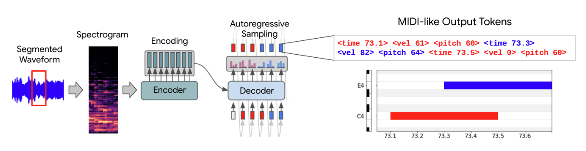
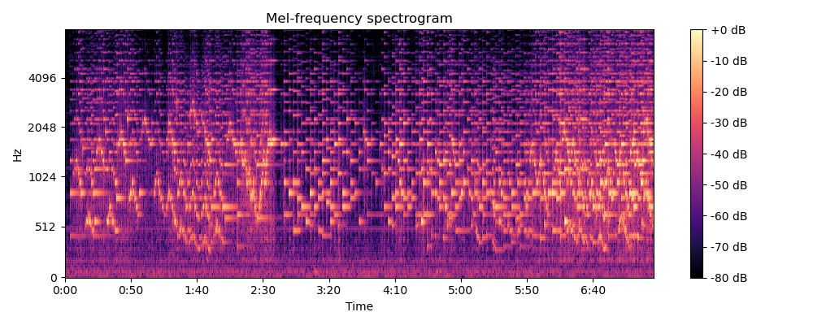

# Sequence-to-sequence Piano Transcription with Transformers in PyTorch

> This is a replication of the 2021 Google paper on automatic music transcription using the standard transformer architecture.

We define automatic music transcription as, given an audiofile, produce a symbolic music represention from it. In this case, it is a MIDI (Musical Instrument Digital Interface) file format.



## Method

### Dataset

The paper uses the [MAESTRO (MIDI and Audio Edited for Synchronous TRacks and Organization) dataset](https://magenta.tensorflow.org/datasets/maestro) first introduced in 2019 by Google. It can be downloaded as follows.

```bash
wget https://storage.googleapis.com/magentadata/datasets/maestro/v3.0.0/maestro-v3.0.0.zip
```

Midi files contain events, of event_types, which contains pitch, velocity and timing.

The dataset consists of `.wav` files, which are uncompressed audio files, and corresponding `.midi` files.

### Data processing

The audio files are first converted into log-Mel spectrograms after downsampling from 44.1 to 16 kHz and using the following parameters

- FFT length (time window for FFT) of 2048 samples
- hop width (distance between consecutive FFT samples): 128 samples
- 512 mel bins (number of Mel frequencies, which turn out to be the feature dimension)
- log (convert to dB)


_Example Mel spectrogram of a file within the MAESTRO dataset._

The MIDI files consist of various tracks, which consists of messages and meta messages. An example is as follows.

```text
Track 0:
MetaMessage('set_tempo', tempo=500000, time=0)
MetaMessage('time_signature', numerator=4, denominator=4, clocks_per_click=24, notated_32nd_notes_per_beat=8, time=0)
MetaMessage('end_of_track', time=1)
Track 1: Cui05-08.mid
MetaMessage('track_name', name='Cui05-08.mid', time=0)
program_change channel=0 program=0 time=0
control_change channel=0 control=67 value=11 time=370
control_change channel=0 control=67 value=22 time=15
control_change channel=0 control=67 value=36 time=15
control_change channel=0 control=67 value=51 time=16
control_change channel=0 control=67 value=64 time=14
control_change channel=0 control=64 value=87 time=15
control_change channel=0 control=64 value=88 time=15
control_change channel=0 control=64 value=89 time=15
note_on channel=0 note=70 velocity=0 time=4
control_change channel=0 control=64 value=89 time=11
note_on channel=0 note=77 velocity=0 time=36
control_change channel=0 control=64 value=90 time=10
note_on channel=0 note=68 velocity=57 time=14
note_on channel=0 note=68 velocity=0 time=88
note_on channel=0 note=67 velocity=60 time=58
note_on channel=0 note=67 velocity=0 time=76
control_change channel=0 control=64 value=89 time=53
control_change channel=0 control=64 value=86 time=15
note_on channel=0 note=60 velocity=0 time=6
note_on channel=0 note=56 velocity=0 time=2
control_change channel=0 control=64 value=81 time=8
note_on channel=0 note=71 velocity=68 time=4
note_on channel=0 note=65 velocity=69 time=5
control_change channel=0 control=64 value=72 time=6
note_on channel=0 note=62 velocity=53 time=1
control_change channel=0 control=64 value=62 time=13
control_change channel=0 control=64 value=0 time=16
```

Explanation

- `note_on` instruction signifies a key pressed
  - `note` is the piano key/ pitch of note. Pianos have 88 keys.
  - `velocity` is the loudness of the key press, which varies from 0 to 127. 0 means the note is turned off.
  - `time` is the time of the message, in ticks, relative to the previous message
- `control_change` signifies
  - `control=64` is the sustain pedal while `control=67` is the soft pedal

To process the MIDI file, I

- converted ticks into milliseconds and assigned an absolute time to every message
- filtered the dataset and only kept note_on events
- converted velocities into binary

### Tokenisation

Each midi instruction is then made up of 3 tokens.

- Absolute time
- Note
- Velocity

Besides, we also add <bos>, <eos> and <pad> utility tokens.

### Dataset and Data loading

Dataset
Say each batch is one music file for simplicity.

- We chunk one music file into N segments of some duration D.
- For each of the N segments, obtain the decoder output for it
  - Precompute the start times
  - Obtain the MIDI sequence for each chunk
  - Tokenise the MIDI sequence

Idea is to tokenise during runtime, we find

### Modelling

The paper uses a pretrained encoder-decoder

## Training

Loss: Cross entropy

1. Model learns to predict the token of 0 duration, as it means 'key-off'
2.

### Inference/ Demo

1. Record a clip
2. Split the clip
3. Decode
4. Decokenise

## Setup

```
brew install fluidsynth
https://github.com/bzamecnik/midi2audio/tree/master?tab=readme-ov-file
```

## References

https://engineering.atspotify.com/2022/06/meet-basic-pitch/

Hawthorne, Curtis, Andriy Stasyuk, Adam Roberts, Ian Simon, Cheng-Zhi Anna Huang, Sander Dieleman, Erich Elsen, Jesse Engel, and Douglas Eck. ‘Enabling Factorized Piano Music Modeling and Generation with the MAESTRO Dataset’. arXiv, 17 January 2019. https://doi.org/10.48550/arXiv.1810.12247.

Hawthorne, Curtis, Ian Simon, Rigel Swavely, Ethan Manilow, and Jesse Engel. ‘Sequence-to-Sequence Piano Transcription with Transformers’. arXiv, 19 July 2021. https://doi.org/10.48550/arXiv.2107.09142.

https://magenta.tensorflow.org/transcription-with-transformers

https://magenta.tensorflow.org/onsets-frames

https://magenta.tensorflow.org/datasets/maestro
